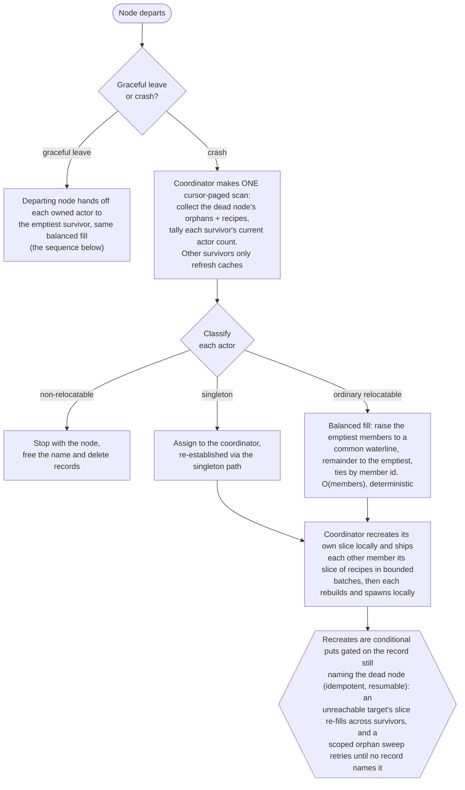
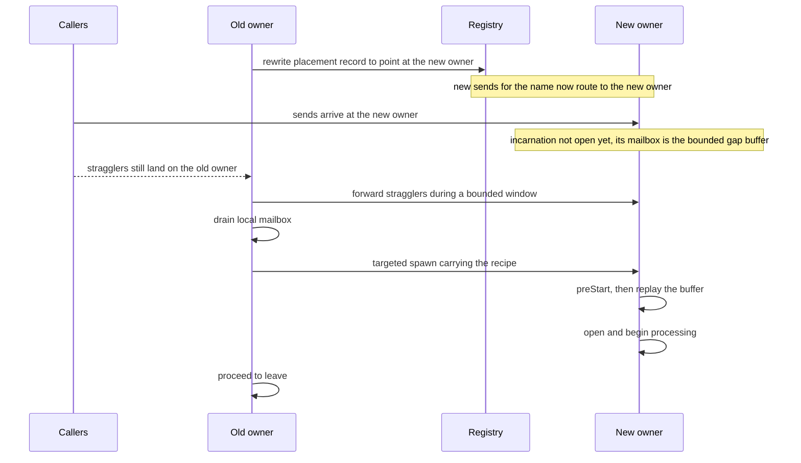

# Distributed actors on the cluster: design

This is the design of the layer that turns a single-node actor system into a cluster of nodes that spawn, address, and message actors without a caller knowing which node an actor runs on. It is the consumer of the cluster runtime: the actor-blind `ClusterNode` and its registry supply a name-to-node directory and lifecycle events, the remoting layer supplies cross-node delivery, and this layer joins the two to the actor tree so that `spawn`, `actorOf`, a placement on a chosen node, and a cluster singleton all work across the whole cluster.

Nothing beneath this layer knows about actors. The cluster runtime is a distributed key/value store with membership and a split-brain resolver; remoting is an address-to-actor message carrier. This layer is the one place the two meet the actor system, and it is the only actor-coupled part of the cluster stack.

## 1. What a clustered node runs

A single node with clustering enabled runs three network endpoints, each with a distinct job:

| Endpoint | Carries                                       | Supplied by                              |
|----------|-----------------------------------------------|------------------------------------------|
| Remoting | actor messages (tell/ask/watch) between nodes | the remoting layer (`Remoting`)          |
| Gossip   | membership: who is in the cluster             | the membership engine (`Swim`)           |
| Data     | the registry key/value traffic                | the cluster transport (`KvNetTransport`) |

The gossip and data endpoints already exist inside `ClusterNode`; the remoting endpoint already exists inside the actor system. This layer does not add a transport. It runs all three on one node and wires them together: membership and the registry decide **where** an actor lives, and remoting decides **how** a message reaches it.

A node therefore has two identities that must be related. Its **cluster identity** is the data address `ClusterNode.address`, the `host:port` the coordinator, resolver, and registry key on. Its **actor identity** is its remoting address `system.host():system.port()`, the `host:port` a message to one of its actors is delivered to. A clustered node advertises its remoting address in its membership metadata, next to the `startedAt`/`ready`/`draining` fields already carried there, so every node can map a cluster member to the endpoint its actors are reached at. This mirrors how the data endpoint itself is already advertised (see section 10).

## 2. Enabling clustering

Clustering is a construction option on the actor system, alongside the remoting option, and remoting is required: a clustered node must be reachable for actor messages, so constructing a system with `cluster` set and no `remote` is a typed construction error rather than a silently local-only node. The cluster's gossip and data endpoints bind the remoting host unless the cluster option overrides it, so one address names the machine.

```ts
const system = new ActorSystem("orders", {
  remote: { host: "10.0.0.7", port: 0 },        // actor messaging endpoint, required with cluster
  cluster: {
    discovery: new DnsDiscovery({ hostname: "orders-headless", recordType: "a", port: 7946 }),
    gossipPort: 7946,
    dataPort: 8080,
    // host defaults to remote.host; partitionCount, replicaCount,
    // writeQuorum, minimumMemberQuorum: cluster defaults
  },
});
await system.start();
```

On `start()`, once remoting has bound and the node knows its own remoting address, the layer wires everything before the node announces itself, so a peer can never select a member whose actor machinery is not yet attached:

1. Constructs a `ClusterNode` (not yet started) with the discovery provider and the gossip/data ports, advertising the node's remoting address in its metadata, and hands it the system's event stream at construction, so cluster lifecycle events flow without a later subscription step.
2. Builds a `ClusterRegistry` over the `ClusterNode` (which structurally satisfies the registry's `write`/`read`/`scan` store).
3. Attaches the **cluster placement** to the actor system through the existing `attachPlacement` hook. The system has a single placement slot, so the cluster placement wraps the worker-pool placement and delegates node-local isolate placement to it: `spawn` routes name claims and cluster placement through the cluster, and local execution through the pool.
4. Starts the `ClusterNode`. The `ready` flag peers consult before selecting a placement target is gossiped only from this point, after the wiring above is in place.

`stop()` and `leave()` unwind in reverse, and they differ. `leave()` is a cluster departure: the node hands off its actors (section 7), departs membership, and keeps running as a single-node system with whatever local actors were not handed off. `stop()` is `leave()` followed by a full system shutdown. A whole-cluster shutdown degenerates gracefully: handoff targets only live, non-draining members, and a departing node that finds none skips handoff rather than chasing peers that are themselves leaving. Discovery is the single public seam of the whole stack; everything else here is internal infrastructure the actor system owns.

## 3. Placement: how a distributed actor is created

The actor system already routes a `spawn` of a `Props` through a `Placement` seam when a placement is attached; today that seam places an actor on one of the node's worker isolates. The cluster supplies its own `Placement` implementation whose "isolates" are nodes. Each method maps onto the registry and remoting:

- **`claim(name)`** maps to `ClusterRegistry.claimActorName(name, thisNode)`: a conditional put that succeeds only if no node has claimed the name. This is the cluster-wide name authority the single-node tree cannot provide. A rejection is the duplicate-spawn signal.
- **`free(name)`** is the reverse notification: the system already calls it when a claimed actor stops, so an explicit stop and a passivation both reach the cluster placement through it, and it is where the placement deletes the actor's registry records.
- **`place(name, props, options)`** claims the name, decides the owning node, and creates the actor there. For a plain `spawn` the owner is this node: the actor is spawned locally (through the wrapped worker-pool placement) and the placement is recorded with `putActor(name, thisNode)`. For a placement targeted at another node it is a remote spawn (section 5). Either way `place` returns a `PID`: a live local PID when the owner is this node, a routed PID when it is another.
- **`find(name)`** resolves a name to a PID without creating anything, synchronously, from the local placement view (section 4).
- **`routeOf(name)`** returns the cluster route (section 4) for a name, the seam the actor system uses to build a routed handle.
- **`stopActor(name)` / `stop()`** drive teardown. `respawn(name)` keeps its existing meaning, a restart in place on the same node with the same identity; moving an actor to another node is re-placement (section 7), not `respawn`.

Because `spawn` already funnels through `Placement`, the public `spawn(name, props)` signature does not change; it becomes cluster-aware by virtue of the attached placement. The one change in behavior is that name uniqueness is now cluster-wide rather than node-local: a second `spawn` of the same name anywhere in the cluster is refused with the existing `ErrActorAlreadyExists`. That is the only change: `spawn` always creates its actor on the calling node, and placing an actor elsewhere in the cluster is exclusively the job of `spawnOn` (section 5).

**A registry claim has three outcomes, not two**: won, lost, or refused with a typed retryable error while the claim's partition is rebalancing or the local half has been stopped by the split-brain resolver. The placement absorbs the third: it retries with bounded backoff inside the caller's timeout budget, so `spawn` observes only success, `ErrActorAlreadyExists`, or its timeout.

**Remote creation crosses as a recipe, not a closure.** A `Props` holds a live class reference and cannot travel. The actor system already converts a `Props` to an `ActorRecipe` for cross-boundary spawn, resolving the class to its registered module URL and validating that the constructor arguments are structured-cloneable. Cluster placement extends that path rather than reusing it untouched, and the extension is explicit: the recipe gains the passivation strategy (a strategy is a name plus its numbers, so it serializes; the current conversion refuses it as if it were live, and that refusal is reversed) and the resolved `relocatable` flag; the spawn options gain `relocatable`; and the control message that carries a recipe between isolates grows the same fields. Live objects (a mailbox instance, a supervisor) still do not cross: a distributed actor configures supervision and mailbox on the node that owns it. The actor class must be registered (`registerActor`) on every node so the module resolves identically.

**Relocation-by-default changes what a plain `spawn` accepts on a clustered node.** A relocatable actor must be rebuildable from its recipe, so a clustered `spawn` of an unregistered class, or of args that are not structured-cloneable, is refused with a typed error rather than silently degraded to non-relocatable; the escape hatch is `relocatable: false` on that spawn, which keeps the actor node-local and recipe-free. The effective flag is resolved on the calling node (the system default plus the per-actor override) and travels as a plain boolean in the recipe; the owning node materializes it purely as whether the companion recipe record is stored, so survivors consult record presence and per-node configuration drift cannot split behavior.

## 4. Addressing and messaging: location transparency

An actor's canonical path already embeds the address of the node it lives on: `nodeakt://<system>@<host>:<port>/<name>`. Location transparency is therefore two existing mechanisms joined by one new directory:

- **The directory** is the registry: `name` to owning node. It is itself distributed, sharded across the cluster the same way every key is, so a lookup reads the name's record from whichever node owns that partition.
- **The delivery** is remoting: given the owner's remoting address, a routed PID delivers `tell`/`ask`/`request`/`watch` to it, with per-actor ordering and cross-node `Terminated` already solved.

`actorOf(name)` stays synchronous and gains remote reach only when clustering is enabled. On a clustered node it is location-transparent: it returns the local actor if one runs here, else the local placement view's routed handle to the owning node, else `undefined`; without clustering it is the purely local `PID | undefined` lookup it has always been. It never blocks on the network, so it answers from a warm view instantly, and a name whose placement this node has not yet learned reads as `undefined` until the view warms. The cluster placement's `find` is the synchronous seam behind it and the one routing consults on every send; the view warms from the placements this node makes, from relocation events, and from the routing layer's own re-resolution against the registry, so a handle to a moved or newly learned owner appears without `actorOf` ever making a blocking call.

**Routing follows a moved actor, and the view is a cache with a stated healing story.** A routed PID pins nothing: the cluster route resolves the current owner on each send from the **local placement view**, entries this node placed itself, learned from resolution reads, or refreshed from relocation events, so a send costs a map lookup and the coordinator and the registry stay off the per-message path. The cache can go stale, and each way it heals is named. A crashed owner heals from the failure itself: the send's lane to the dead endpoint fails at the sender, the route invalidates the entry, re-resolves from the registry, and routes fresh sends to the new owner. A gracefully moved owner heals from forwarding: the losing node rewrote the record, so it knows the new owner and relays misrouted sends for a bounded window while stale senders catch up from `RelocationCompleted`; after the window, an ask to the wrong node is refused with the existing dead-target error and re-resolves, and a tell dead-letters observably at the far node, the accepted cost of a fire-and-forget send outliving every healing mechanism.

**Ordering and failure inherit remoting's contracts.** Messages to one actor ride a single lane keyed by its path, so per-actor order holds across the hop. A remote `tell` never throws and dead-letters on an undeliverable target; a remote `ask` rejects on timeout or connection loss; remote death and connection loss are deliberately indistinguishable.

**Watch is per-incarnation.** A cross-node watch delivers exactly one `Terminated`, and a relocation stops the old incarnation, so watchers of a moved actor receive `Terminated` even though the name lives on elsewhere. That is the contract, not an accident: a watcher that must follow a relocatable name re-watches through `actorOf`, and a `RelocationCompleted` subscriber can automate exactly that. Transferred watches would need a mechanism of their own and are deliberately not designed.

## 5. Placing on a chosen node

Beyond a local `spawn`, the layer exposes placing an actor on a node the caller does not run on. The owner is chosen by a **placement strategy** carried in the options, not a raw address, so callers do not hard-code topology:

```ts
// place on the node the strategy selects
const ref = await system.spawnOn(name, Props.create(Worker, config), { strategy: "leastLoad" });
```

`spawnOn` claims the name cluster-wide, selects the owner via the strategy, ships the recipe to it as a remote spawn, records the placement, and returns a routed handle. The strategies are a closed set of four. `roundRobin`, the default, rides the registry's atomic `nextRoundRobinValue`, so every node advances the same counter and the load spreads without a coordinator on the path. `random` picks a uniformly random live member. `local` places on the calling node, so a call site can opt out of distribution without changing shape. `leastLoad` picks the member owning the fewest actors by `countActorsByHost` (a full registry scan per call, priced for placement frequency, not for loops). A raw address is deliberately not a strategy: callers express intent, not topology.

A `spawnOn` that loses the name race is refused with `ErrActorAlreadyExists`, exactly like `spawn`: handing the loser a handle to an actor built from someone else's `Props` would turn a race into silent misconfiguration, and a caller that wants the existing actor resolves it with `actorOf`. `singleton` (section 6) is the one deliberately idempotent creation call.

## 6. Cluster singletons

A singleton is an actor with exactly one live instance across the whole cluster, reached by the same name from every node:

```ts
const ref = await system.singleton(name, Props.create(Sequencer));
```

A singleton is not a new kind of actor; it is an ordinary named, always-relocatable actor with three extra properties. It is **idempotent to create**: `singleton(name, props)` claims the name with the same cluster-wide `claimActorName` every spawn uses, and a caller that loses the claim receives a routed handle to the existing instance instead of `ErrActorAlreadyExists`; when two nodes race with different `Props`, the winner's props win, the price of idempotence. It is **placed on the coordinator**: the winning caller does not spawn locally but targets the oldest live member, the one deterministic node every view agrees on, so a singleton's location is predictable and moves only when its host departs. And it is **always relocatable**: its companion recipe record carries a singleton marker, and when its host departs, the ordinary re-placement pass of section 7 recreates it, pinned to the current coordinator rather than a placement strategy. There is no separate lease, no renewal clock, and no second recovery path racing the first: at-most-one rests on the same claim that makes every name unique.

Singletons share the actor namespace: after `singleton("sequencer")`, a `spawn("sequencer")` anywhere in the cluster is refused as a duplicate, and vice versa.

Like name uniqueness itself, at-most-one depends on the split-brain resolver being on: a forked cluster whose two halves each keep serving could otherwise mint two owners for one name, so a clustered deployment runs with `minimumMemberQuorum` set and the resolver active.

## 7. Relocation and handoff

Three movements happen when the cluster changes, and keeping them apart is worth a paragraph. The store **rebalances** its own data on every membership change: the coordinator recomputes partition ownership and the registry's records redistribute across nodes. That is transparent to actors, because a lookup still resolves a name to its current owner, and it is not what moves an actor. Actor instances do not move when a node *joins*; a join only widens where future placements can land. An actor instance moves only when the node it runs on **departs**, gracefully or by crash. Whether it moves is **relocation**, a per-actor policy; how it moves is **handoff**, the stop-here then start-there mechanism. So rebalancing redistributes data, relocation decides whether an actor follows, and handoff carries the ones that do.

The overall flow, from a membership change to each actor's outcome:



**Every recovery is driven by the coordinator, in a single pass.** All survivors receive `NodeLeft`, but only the coordinator acts on it; the others refresh their routing caches. The coordinator makes one cursor-paged scan of the registry that does three jobs at once: it collects the departed node's relocatable placements, reads their companion recipes from the reserved prefix, and tallies how many actors each surviving member currently owns. That single streamed walk replaces both a separate `countActorsByHost` scan and a separate orphan-derivation scan, so recovery reads the registry once however many actors the dead node held. From the tally it places the orphans **analytically, by balanced fill** instead of actor by actor: it raises the emptiest members to a common waterline, so each survivor's quota is what brings it up to that level and any indivisible remainder lands on the emptiest members, ties broken by member id. Actor counts end up equal across the cluster to within one, at the cost of one sort of the members and one slice of the orphan list, independent of how many actors move and with no shared counter on the path. Because the orphans are ordered by name and the rule is deterministic, every coordinator computes the identical plan, which is what lets a successor's resume converge rather than reshuffle. Singletons are the one exception: each is assigned to the coordinator itself and re-established through the singleton path (section 6).

**Recreation fans out and is idempotent by conditional write.** The coordinator recreates its own slice locally and ships every other member its slice of recipes in bounded, concurrent batches; each member rebuilds and spawns its actors from the recipes it receives, so the work scales with the cluster instead of funnelling every spawn through the coordinator. Every recreate is a conditional put gated on the record still naming the dead node, so the pass is idempotent without a read-then-write window: a coordinator that dies mid-relocation is resumed by its successor, which recomputes the same plan on its own `NodeLeft` and whose writes collapse already-done work to no-ops. A target that goes unreachable mid-relocation does not fail its slice; the coordinator re-fills that member's unplaced orphans across the remaining survivors by the same rule, taking them locally when no other survivor is left, and a failed load tally degrades the fill to an even split rather than aborting the pass. The `NodeLeft` ordering gate the cluster runtime already enforces makes the scan read a directory with the departed node's partitions promoted; its timeout backstop means the scan can still be best-effort under a wedged repair, so the coordinator also runs a **periodic orphan sweep**, scoped to the departed host's records and short-circuiting when none remain, re-running the same conditional fill until no record names a departed member. `RelocationFailed` is therefore not terminal: the records survive and the next sweep retries. Recovery is observable on the event stream: `RelocationStarted` when a pass begins, `RelocationCompleted` when every relocatable actor in it has a new owner, `RelocationFailed` carrying the names the pass could not place.

**A graceful leave hands off before departing, and the departing node drives it.** The departing node stops accepting new placements and, for each actor it owns, performs a targeted handoff (below) that ends with the actor running elsewhere and its record rewritten; only then does it call the cluster runtime's `leave()`, whose own data drain and membership departure follow as a second, separate window. The coordinator's crash path is the backstop: a node that dies mid-handoff is just a crash with fewer orphans.

**Handoff is a lifecycle protocol.** Moving one actor is sequenced so that "drained" is reachable while the cluster keeps sending: first the losing node picks the target (the emptiest survivor, by the same balanced fill the crash pass uses) and rewrites the placement record, so new sends route to the new owner, where the not-yet-open incarnation's mailbox is the bounded gap buffer, so no send is lost while it starts; the losing node forwards stragglers that still arrive for the name during a bounded window; it then drains its local mailbox, ships the recipe in the targeted spawn, and the new incarnation runs `preStart`, replays its buffer, and opens. The buffer has one owner (the new incarnation) and one overflow contract: an ask or request over a full buffer is refused with a typed, retryable error; a tell over a full buffer dead-letters, observably, at the far node, because a fire-and-forget send has no channel to carry a refusal (section 4).

The single-actor handoff, sequenced so the placement record moves before the actor drains, which is what makes "drained" reachable while the cluster keeps sending:



**Relocation is opt-out, per actor and cluster-wide.** Not every actor should move when its node departs. One bound to a resource that lives only on its node, or whose identity is meaningless anywhere else, should die with its node rather than be recreated on a survivor. Whether an actor relocates is a flag with two levels: an actor-system default carried in the cluster configuration, relocation **on** by default so a departing node's actors are recreated, and a per-actor override on the spawn options that wins over the default. Both the graceful handoff and the crash re-place apply only to actors that are relocatable; a non-relocatable actor is stopped with its node, its name is freed by the coordinator's pass rather than rewritten to a survivor, and nothing recreates it. A singleton is always relocatable, since its recovery *is* a relocation (section 6), so the flag governs `spawn` and `spawnOn` actors, not singletons.

**Relocation is what ties an actor to recipe storage.** To recreate a relocatable actor, a survivor must know what to build, and the node that knew is the one that just left. So a relocatable actor stores its `ActorRecipe`, the same recipe a remote spawn ships (module, actor, args, and the data options of section 3), as a companion record in the registry keyed by its name under a reserved prefix, so companion records never collide with actor names, written on spawn and removed on stop. Re-placement reads that record and rebuilds the `Props` from it. A non-relocatable actor stores only its placement, since nothing will rebuild it. The placement record itself stays the owner address so `actorsByHost` and routing keep reading a plain `host:port`; the recipe lives beside it, read only when an actor must be recreated.

**Passivation is a stop, not a departure.** A clustered actor that passivates is removed exactly like one stopped explicitly: the stop path already notifies the placement through `free`, which deletes the placement and recipe records and frees the name for a future spawn. Nothing relocates or reactivates a passivated actor. Reactivation on demand, where a message to an idle name transparently revives it, is the virtual-actor model: a distinct, later design that this layer's registry and routing are built to carry (section 12).

## 8. Entity state without a persistence layer

The framework has no persistence layer and will not grow one: no disk, no write-ahead log, no external store, on any node, ever. That is a decision, not a gap, and actor state fits inside it with no new mechanism, because the lifecycle already carries the recovery hook.

**Recreation is the recipe plus `preStart`.** A relocated actor is rebuilt on the target node from its recipe, `new` over its registered class with its constructor arguments (section 3), and then its own `preStart(ctx)` runs before it takes a message. `preStart` is exactly where the framework already has an actor acquire its dependencies and recover its state, and it runs identically on a fresh spawn, a supervisor restart, and a relocation, which are all just incarnations of the same actor. So an actor that must come back with state recovers it in `preStart`, from whatever source of truth it owns, reached through the `Context` that hands it its actor system and therefore the cluster. There are no messages in `preStart` to replay, and there is deliberately no framework `snapshot()`/`restore()` pair: it would be a second recovery path competing with the one the actor already implements.

**What travels is configuration, not accumulated state.** The recipe carries the constructor arguments, validated structured-cloneable, so the dependencies and identity an actor is built with cross intact; state the actor mutates after construction does not ride along, and by the framework's own contract it should not, since state belongs in `preStart`, not the constructor, precisely so every incarnation rebuilds it the same way. An actor whose state must outlive its process keeps that state in its own store and reloads it in `preStart`; one whose state is a cache over something authoritative elsewhere just rebuilds the cache. The cluster carries the actor's identity, the developer owns its state: the honest division a no-persistence framework can make.

## 9. Public API

The surface the actor system gains, with the framework's existing naming (camelCased, a `Props`/`PID` vocabulary):

| Call                                        | Meaning                                                                                          |
|---------------------------------------------|--------------------------------------------------------------------------------------------------|
| `new ActorSystem(name, { cluster })`        | enable clustering; `remote` is required on the same node                                         |
| `spawn(name, props, options?)`              | unchanged signature; name is now unique cluster-wide, actor local; options gain `relocatable`    |
| `spawnOn(name, props, options?)`            | place on the node the options' strategy selects; returns a routed handle                         |
| `actorOf(name)`                             | synchronous and location-transparent: the local actor, else a routed handle to the owning node from the local view, else `undefined`             |
| `singleton(name, props, options?)`          | the one cluster-wide instance of `name`, idempotent to create, hosted on the coordinator         |
| `subscribe(subscriber)` on the system       | `NodeJoined`, `NodeLeft`, `CoordinatorChanged`, `RebalanceStarted`, `RebalanceCompleted`, `RelocationStarted`, `RelocationCompleted`, `RelocationFailed` |
| `leave()`                                   | leave the cluster: hand off actors, depart membership, keep running as a single-node system      |

Only `spawnOn`, `singleton`, and the `cluster` option are new surface; `spawn`, `actorOf`, and event subscription are the existing methods made cluster-aware through the attached placement, `actorOf` now returning a routed handle for a name owned elsewhere while keeping its synchronous `PID | undefined` contract. Nothing about the single-node API changes for a node that does not enable clustering. The cluster runtime's own lifecycle events (type-discriminated records on its internal stream, including the rebalance pair) are re-published by this layer as event classes, matching the system stream's `instanceof` convention; the relocation events are a new family this layer defines.

**Relocation is configured at two levels.** The `cluster` option carries a `relocation` default for the whole system (on by default, so a departing node's actors are recreated on survivors), and each `spawn`/`spawnOn` accepts a `relocatable` override on its options that wins over that default for the one actor. Both are plain data, so the per-actor flag travels with the actor's recipe to whichever node owns it. Disabling relocation on the system turns the default off; setting `relocatable` on a spawn opts a single actor in or out regardless (section 7).

## 10. What the cluster runtime must add

The engines beneath, membership and the store, are untouched: membership gossips metadata as an opaque blob whose format belongs to this layer's own codec, and no message, record shape, or protocol in the store changes. The clustering layer above them gains three small, contained additions:

- **The remoting address in node metadata.** Encoded beside `startedAt`, `ready`, `draining`, and the data endpoint the record already advertises, as a second length-prefixed field old decoders skip. The store's member contract stays actor-blind, so the decoded address does not ride the store's member type; the cluster node exposes its own member-to-remoting-address lookup from the decoded view, and that accessor is what routing consults.
- **A prefix-aware registry.** Companion recipe records live under a reserved key prefix, and `actorsByHost`/`countActorsByHost` filter placement records by that prefix structurally, instead of relying on a companion value failing to parse as an address, which a value embedding an address string would defeat.
- **Public discovery exports.** Discovery is the stack's one public seam, so the package exports the discovery provider contract and its implementations, which nothing exports today.

## 11. Testing strategy

The placement and routing logic is exercised the way the rest of the cluster is: against the store's deterministic simulation harness with scripted membership and a seeded clock, so a spawn, a lookup, a targeted placement, a singleton claim, a graceful handoff, and a crash re-placement each reproduce from a printed seed. The seeded set includes the specific races this design closes: every survivor receiving `NodeLeft` while only the coordinator acts, a coordinator dying mid-relocation and its successor resuming the pass, and a tell-only sender healing across a graceful move through the forwarding window. The recipe round trip and the buffer-and-replay handoff are unit-tested in isolation. Two things a simulation cannot prove are covered against real processes: cross-node actor messaging over remoting under an oversized payload, and three nodes forming, one losing a member to a hard signal, and the survivors re-placing and continuing to route to the moved actors. Every source file holds full coverage, and the throughput benchmark runs with clustering active to confirm local resolution keeps the coordinator and the registry off the message path.

## 12. Design decisions

- **Placement is registry-recorded, not hash-derived.** An actor lives where it was spawned (or placed), recorded in the registry, rather than on a deterministic partition-primary of its name's hash. This matches `spawn`/`spawnOn`/`singleton` semantics, where a caller creates a specific actor on a specific or chosen node. Deterministic placement of many like entities (virtual actors: activated on demand, passivated when idle, their state reloaded on activation) reuses the same routing table and registry but is a distinct, later design; the routing layer here is built so it can adopt that model without change.
- **One identity for a member, remoting resolved from it.** A placement records the owning cluster member; the member's remoting address is resolved from the membership view, not stored per actor. This keeps `actorsByHost` and re-placement keyed on the stable member identity and avoids a compound value in every record.
- **Resolve locally, re-resolve on a miss.** Routing uses the local placement view rather than a lookup round trip per message, and heals staleness from named signals: sender-side lane failure for a crash, the forwarding window and relocation events for a graceful move. The coordinator and the registry stay off the hot path.
- **The coordinator drives every recovery.** Crash re-placement, singleton recreation, name-freeing for non-relocatable actors, and the orphan sweep are performed only by the coordinator, with every write conditional on the record still naming the departed node, so recovery is idempotent, deduplicated across survivors, and resumable by a successor coordinator. Survivors that are not the coordinator only refresh caches.
- **Re-placement is a balanced fill computed once, not a per-actor loop.** The coordinator reads the registry a single time to collect the dead node's orphans, their recipes, and every survivor's current actor count, then equalizes counts by raising the emptiest members to a common waterline, deterministically, so the plan costs one sort of the members rather than a scan of the candidate set per actor, needs no round-robin counter, and a successor coordinator recomputes the identical plan so its conditional writes dedupe instead of reshuffling. A greedy per-actor least-loaded scan and a shared round-robin counter were both rejected: the first rescans the candidate set for every actor and the second serializes placements through one hot key and gives no balance guarantee. The `roundRobin`/`leastLoad` strategies of section 5 stay what a caller asks for on `spawnOn`, not how recovery re-places.
- **Singletons are placement policy, not a lease.** A singleton is an ordinary always-relocatable actor pinned to the coordinator and claimed with the same name claim as any spawn. A time-based lease was considered and rejected: the store's leased claim tests presence, not holder, so a healthy owner could not renew and its lapsed lease would mint a second instance; pinning to the coordinator needs no clock at all.
- **Recipes cross, not closures.** Remote creation extends the existing `Props`-to-`ActorRecipe` conversion and its registration requirement, rather than inventing a code-shipping mechanism. Live spawn options stay node-local by design; data options travel.
- **Actors relocate by default, opt out per actor.** A departing node's actors are recreated on survivors unless marked non-relocatable, the safe default for the stateless and recomputable actors that are the v1 floor. Relocation, not rebalancing, is what moves an actor: rebalancing redistributes the registry's own data on any membership change and is transparent to actors, while relocation recreates an actor instance only when its node departs. A relocatable actor stores its recipe as a companion registry record so any survivor can rebuild it; a non-relocatable one stores only its placement and is not recreated.
- **Recreation is the recipe plus `preStart`, not a state transfer.** The framework has no persistence layer, by decision rather than omission, and it does not snapshot actor state to move it. A relocated actor is rebuilt from its recipe (its constructor arguments) and recovers whatever state it needs in `preStart`, the same hook that runs on a fresh spawn and a supervisor restart; a `snapshot()`/`restore()` pair was rejected as a second recovery path competing with `preStart`. State that must outlive a process belongs to the actor's own store, reloaded in `preStart`.
- **Placement strategies are a closed set.** `roundRobin`, `random`, `local`, and `leastLoad`, each resolvable from the local membership view plus at most one registry counter. A raw address is not a strategy, so topology stays out of call sites. Node role labels for heterogeneous placement are deliberately excluded until a need shows up; every strategy treats live, ready members as equal candidates.
- **Singletons and uniqueness require the resolver.** At-most-one-instance rests on the split-brain resolver, so a clustered deployment runs with a member quorum set; the resolver is what makes a forked cluster stop rather than mint a second owner.

## 13. Delivery

This section is the build sequence and is meant to be removed once the phase ships, the way the clustering runtime's delivery plan was. The order is dependency-first, each step tested against the harness with full coverage on touched files and clean `tsc` and `biome`.

1. **Node identity and registry groundwork.** The remoting-address metadata addition with its view accessor; the reserved-prefix registry filtering and companion-record accessors; public discovery exports; the actor system constructing, wiring, and starting a `ClusterNode` and `ClusterRegistry` on `start()` when the `cluster` option is set (remoting required), unwinding them on `stop()`/`leave()`.
2. **Local placement and uniqueness.** The cluster `Placement` wrapping the worker pool: cluster-wide `claimActorName` with bounded retry of retryable refusals, `putActor` on spawn, `free`-driven record deletion on stop and passivation, `spawn` refusing a duplicate name cluster-wide; the recipe extension (recipe fields, spawn options, control message) and the relocatable-resolution rule. No remote spawn yet.
3. **Resolution and routing.** The local placement view behind `find`, synchronous `actorOf` over it, and the cluster route: local resolution per send, invalidation on lane failure, re-resolution from the registry.
4. **Remote placement.** `spawnOn` with the options-carried strategies over the recipe path and `nextRoundRobinValue`, refusing lost races, returning routed handles.
5. **Singletons.** The idempotent claim, coordinator placement, and the singleton marker on the companion record.
6. **Relocation and handoff.** The coordinator-driven `NodeLeft` pass with conditional rewrites and the periodic orphan sweep; the departing-node targeted handoff with record-rewrite-first sequencing, the forwarding window, and the buffering incarnation; the relocation event family and the re-published runtime events.
7. **Real-process proof.** A runnable example and a multi-process test: three nodes, a distributed spawn and cross-node message, a targeted placement, a singleton, a hard kill with re-placement, a stateful actor that recovers its state in `preStart` after the kill, a graceful handoff, and a stale tell healing across a graceful move.
