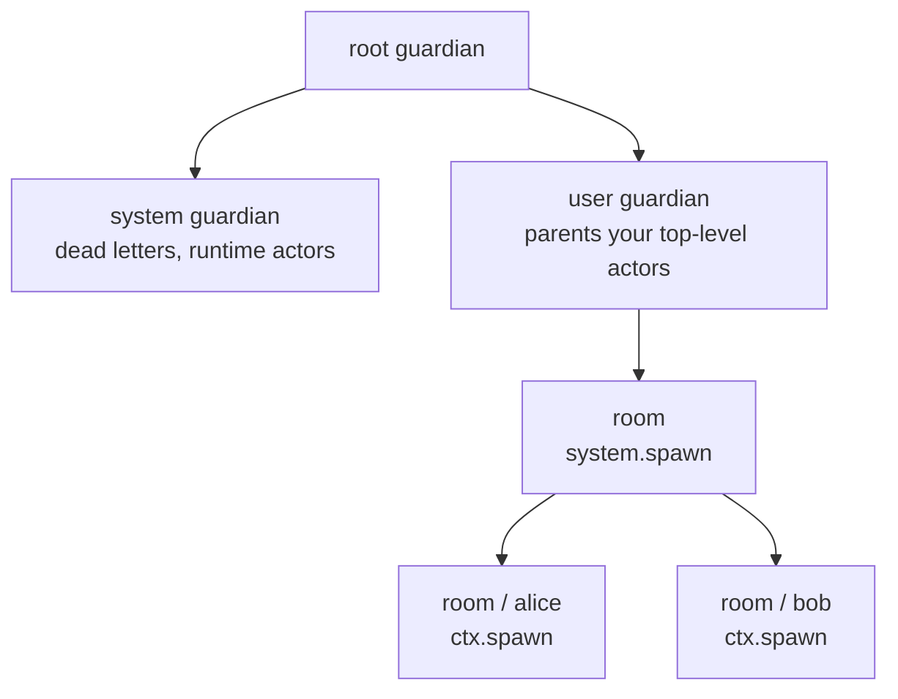

# Hierarchy and stop

Every user actor spawned with `system.spawn` is a child of the user guardian. From `receive`, spawn further children with `ctx.spawn`. The parent executes the child's [supervision](supervision.md) directive when that child fails.

Example: [`examples/watch`](https://github.com/Tochemey/nodeakt/blob/main/examples/watch/main.ts), [`examples/chat`](https://github.com/Tochemey/nodeakt/blob/main/examples/chat/main.ts).

## The tree

Actors form a supervision tree. Above your own actors sit three runtime guardians: the **root guardian** at the top, the **system guardian** that parents the runtime's internal actors (dead letters and other machinery), and the **user guardian** that parents every actor you spawn with `system.spawn`. Each of those actors can spawn children of its own with `ctx.spawn`.



The guardians are supervision structure, not part of any address: an actor's path starts at its own top-level name, never at `/user`. So `room`'s path is `nodeakt://sys@127.0.0.1:0/room`, and every child extends its parent's path:

```text
nodeakt://sys@127.0.0.1:0/room
nodeakt://sys@127.0.0.1:0/room/alice
```

## Spawn a child

```ts
const child = await ctx.spawn(name, actor, options?);
// same method on the PID: await pid.spawnChild(name, actor, options?)
```

`actor` is a **live instance**. `ReceiveContext.spawn` does not accept `Props`; children always run on the **same isolate** as the parent. To place work on another core, spawn that actor at the top level with `Props`. See [Multi-core](../multi-core/index.md).

Name rules match top-level spawn (`ErrReservedName`, `ErrInvalidActorName`). `preStart` failure throws `ActorInitializationError` and the child is not registered.

If this actor is not running, `spawnChild` throws `ErrDead`.

If a child with that name already exists under this parent, `spawnChild` returns the existing PID instead of throwing. Top-level `system.spawn` does the opposite: a taken name throws `ErrActorAlreadyExists`.

The two spawn entry points, their options, and every failure are covered together in [Spawning](spawning.md).

## Inspect

| Method            | Meaning                                                                                                                                        |
|-------------------|------------------------------------------------------------------------------------------------------------------------------------------------|
| `ctx.children()`  | Running children.                                                                                                                              |
| `ctx.child(name)` | The running child of that name. Throws `ErrDead` if this actor is not running; throws `ActorNotFoundError` if no running child holds the name. |
| `pid.parent()`    | The PID that spawned this actor, or `undefined` at the top of the user tree.                                                                   |

## Stop a child

```ts
await ctx.stop(child);
```

The child finishes its current message, drains, and runs `postStop`.

| Failure              | When                                                                                                   |
|----------------------|--------------------------------------------------------------------------------------------------------|
| `ErrDead`            | This actor is not running.                                                                             |
| `ErrUndefinedActor`  | `child` is the PID returned by `system.noSender()`.                                                    |
| `ActorNotFoundError` | `child` is not a live child of this actor (not running and not suspended, or not this parent's child). |

Stopping the receiving actor itself is `ctx.shutdown()` (fire-and-forget from `receive`) or `await pid.shutdown()` from outside. Children shut down with their parent.

Sending `new PoisonPill()` via `tell` also begins a graceful stop, after messages already ahead of the pill in the mailbox.

## Watch

An actor can watch another and receive a `Terminated` message when it stops. Death watch has its own page: **[Death watch](death-watch.md)**.

## Stopping from another isolate

`pid.shutdown()` on a handle whose actor lives on another isolate rejects with:

```text
TypeError: an actor owned by another isolate cannot be stopped through its handle
```

Stop a remote actor by sending it a message it handles by calling `ctx.shutdown()`, or by sending `PoisonPill`.
