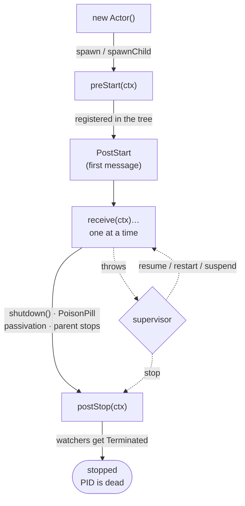

# Lifecycle

An actor moves through a small, fixed set of phases: it is constructed, started, processes messages one at a time, and eventually stops. The runtime drives every transition. This page is the map of what happens when, and which hook or message each transition runs.

## At a glance



A failure branches off this path: a throw from `receive` engages the actor's [supervisor](supervision.md), which may **resume**, **restart**, or **suspend** the actor rather than stop it (the dotted edges), instead of letting it run to `postStop`.

## Hooks

The [`Actor`](index.md) interface defines three hooks. Each may be synchronous or return a promise the runtime awaits.

| Hook | When it runs | On failure |
| --- | --- | --- |
| `preStart(ctx)` | Once, before the actor is registered or receives any message. | Aborts the start. Surfaces as an `ActorInitializationError` (the cause is on `error.cause`) wherever the actor was spawned. The actor is never registered and never receives a message. During a [restart](#restart), a failed `preStart` leaves the actor [suspended](#suspend-and-reinstate). |
| `receive(ctx)` | Once per message, strictly one at a time. When it returns a promise, the next message is not dequeued until that promise settles. | Engages the actor's [supervisor](supervision.md). |
| `postStop(ctx)` | Once, after the mailbox has drained and the children have stopped, before the actor leaves the tree. | Logged, never rethrown. The stop always completes. Keep the hook short. |

`preStart` and `postStop` receive a [`Context`](index.md#context-vs-receivecontext): the actor's identity and its system, not a message. `receive` receives a [`ReceiveContext`](messaging.md): the message and the tools to act on it.

> [!IMPORTANT]
> Initialize state in `preStart`, not in the constructor. A [restart](#restart) reuses the same instance and re-runs `preStart`, but never re-runs the constructor. State set in the constructor survives a restart stale; state set in `preStart` is rebuilt fresh each time.

> [!NOTE]
> There is no init deadline. `preStart` runs to completion however long it takes, and the actor is not available until it resolves. If startup can hang, bound it yourself, for example with `Promise.race` against a timeout inside `preStart`.

## Starting

`system.spawn` and `ctx.spawn` (or `pid.spawnChild`) construct the actor, run `preStart`, register the actor in the hierarchy tree, and enqueue `PostStart` as the very first message. Only after `preStart` resolves is the actor reachable by name and able to receive.

`PostStart` is delivered from `system.noSender()` before any other sender can reach the actor, so it is guaranteed to be the first message every user actor sees. Use it for work that must run **inside** the message loop rather than in `preStart`, most commonly spawning children through `ctx.self`. Runtime-internal actors that start while the system itself is still starting do not receive it; every user actor does.

## States

A live actor is in one of these states. The transient states are internal; the two that outlast a single turn are queryable.

| State | Meaning | Query |
| --- | --- | --- |
| **Running** | Started, not stopping, not suspended: accepting and processing messages. | `pid.isRunning()` |
| **Suspended** | Faulted and held by supervision: keeps its state, mailbox, and stash, but processes nothing until restarted or reinstated. | `pid.isSuspended()` |
| **Stopping** | A graceful stop is draining the mailbox and running `postStop`. New sends are rejected. | (transient) |
| **Stopped** | Fully torn down and removed from the tree. The PID is dead; sends [dead-letter](../actor-system/events.md). | `pid.isRunning()` is `false` |

`pid.restartCount()` reports how many times the current instance has been restarted. A handle for an actor owned by another isolate always reports `isRunning()` as `false`: liveness across isolates is not synchronously knowable, so [watch](death-watch.md) it instead.

## Stopping

`pid.shutdown()` is a graceful stop and returns a promise that resolves when the actor is fully gone. In order:

1. New sends are rejected; messages already in the mailbox still drain.
2. The actor's children are stopped first, depth-first. Sibling order is not guaranteed.
3. `postStop` runs.
4. Every actor [watching](death-watch.md) this one receives a `Terminated` message.
5. The actor leaves the tree. Its mailbox and stash are disposed.

Repeated `shutdown()` calls return the same promise; stopping an actor that never started is a no-op. An actor owned by another isolate cannot be stopped through its handle; `shutdown()` rejects with a `TypeError`.

`PoisonPill` is the message form of the same graceful stop. It travels through the mailbox like any other message, so everything enqueued ahead of it is processed first, then the actor stops. The runtime consumes it; it never reaches `receive`.

```ts
system.noSender().tell(pid, new PoisonPill());
```

[Passivation](passivation.md) stops an actor the same way once it has been idle past its configured strategy, so an idle actor releases its resources without an explicit stop.

## Restart

A [supervisor](supervision.md) may restart a faulted actor instead of stopping it. `pid.restart()` (also driven internally by supervision) tears the actor down and re-initializes it on the **same instance**:

1. Children are stopped.
2. `postStop` runs, unless the actor was already suspended.
3. Behavior stack, stash, and the processed-message counter reset.
4. `preStart` runs again.
5. Messages still queued in the mailbox are processed by the re-initialized actor.

The actor keeps its `PID`, its [path](index.md#path), and its place in the tree across a restart. `restart()` throws `ErrDead` when the actor is stopping, already restarting, or never started; a failed `preStart` leaves the actor suspended so the restart can be retried.

## Suspend and reinstate

When `receive` throws and the supervisor neither resumes nor stops the actor, the actor is **suspended**: it holds its state, mailbox, and stash but processes nothing. `pid.reinstate(target)` lifts the suspension and resumes processing without resetting state, the counterpart to a restart's full re-initialization. Pass a `PID`, or a child name relative to this actor. See [Supervision](supervision.md) for how directives choose between resume, restart, suspend, and stop.

## System messages

The runtime delivers these alongside your own messages. Handle them in `receive` with `instanceof`, the same way you narrow business messages.

| Message | Delivered to `receive`? | Role |
| --- | --- | --- |
| `PostStart` | Yes | The first message after start. Run post-start setup here. |
| `Terminated` | Yes | A [watched](death-watch.md) actor has stopped. Carries its `actorPath`. |
| `PanicSignal` | Yes | A child's failure [escalated](supervision.md) to this actor. Carries the `reason`; the sender is the failing child. |
| `PoisonPill` | **No** | Requests a graceful stop. The runtime consumes it before `receive`. |

## Observing the lifecycle

Lifecycle signals are observable from outside an actor two ways:

- **A single actor's end**, through [death watch](death-watch.md): `ctx.watch(target)` registers this actor to receive a `Terminated` message when `target` stops. This is the supported way for one actor to react to another ending, whether it stopped, was passivated, or failed terminally.
- **Every actor's transitions**, through the [event stream](../actor-system/events.md): the runtime publishes a lifecycle event on each transition, `ActorStarted`, `ActorStopped`, `ActorPassivated`, `ActorRestarted`, `ActorSuspended`, `ActorReinstated`, and `ActorChildCreated`, alongside `Deadletter`. Subscribe once to observe the whole system without touching actor code.

Watch an actor to react to one actor's end inside another; subscribe to the event stream to observe the system as a whole; and observe an actor's own phases from inside its hooks and `PostStart`.
