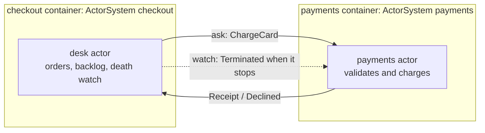

# Remoting: checkout and payments

Two services a working developer will recognize: a **checkout** node that takes orders and a **payments** node that charges them, each its own process, each its own machine as far as the runtime is concerned. Docker Compose plays the role of the two machines.



Every arrow is a message over plaintext TCP on the Compose network.

What it shows, in the order the logs show it:

- **`remoteLookup` with a retry loop.** The desk resolves the `payments` actor by name and keeps trying until that node is up; readiness ordering between containers stops mattering.
- **A remote actor is an ordinary PID.** Charges are `ctx.ask` calls on the looked-up handle, piped back to the desk's own mailbox with `pipeTo`, so the desk keeps taking orders while charges are in flight.
- **Typed messages across the wire.** `ChargeCard`, `Receipt`, and `Declined` are classes registered once in [messages.ts](messages.ts) and narrowed with `instanceof` on both nodes.
- **Death watch as the failover signal.** The desk `watch`es the payments actor; the node dying and the actor stopping arrive as the same `Terminated` message. The desk queues orders while payments is gone, re-resolves, and flushes the backlog when it returns.
- **A zero-dependency image.** The [Dockerfile](Dockerfile) is Node, the tsx loader, and the framework source. No install step, nothing else to ship.

## Run it

From the repository root:

```bash
make remoting
# or
docker compose -f examples/remoting/docker-compose.yml up --build
```

Steady state looks like this (one order per tick; the barista course exceeds the charge limit and the mugs ride a hotlisted card, so both decline paths appear):

```
checkout-1  | [checkout] order ord-0001: espresso beans, 1kg (£23.50)
payments-1  | [payments] charged ord-0001: £23.50 (txn-00001)
checkout-1  | [checkout] ord-0001 paid (txn-00001)
checkout-1  | [checkout] order ord-0004: barista course (£899.00)
payments-1  | [payments] DECLINED ord-0004: over the charge limit
checkout-1  | [checkout] ord-0004 declined: amount over the charge limit
```

## Break it

You watch an **actor**, never a node: the desk's `watch` is on the payments actor's PID. A node dying simply terminates every actor it hosted, so both causes arrive as the same `Terminated` message, indistinguishable on purpose, and one recovery path covers them. The example drills both.

**The actor stops, the node stays up.** This one runs by itself: about 25 seconds in, the payments node performs a maintenance restart, stopping the payments actor and respawning a fresh incarnation five seconds later. The container never blinks; the desk still sees a death.

**The node dies.** In a second terminal:

```bash
docker compose -f examples/remoting/docker-compose.yml stop payments
# watch checkout queue orders...
docker compose -f examples/remoting/docker-compose.yml start payments
```

Either way the desk sees the death as a message, holds the shop's orders, and recovers on its own:

```
payments-1  | [payments] maintenance: stopping the payments actor; the node stays up
checkout-1  | [checkout] payments is GONE; queueing orders and re-resolving
checkout-1  | [checkout] order ord-0016: espresso beans, 1kg (£23.50)
checkout-1  | [checkout] ord-0016 queued; 1 order(s) waiting
checkout-1  | [checkout] order ord-0018: hand grinder (£128.00)
checkout-1  | [checkout] ord-0018 queued; 3 order(s) waiting
payments-1  | [payments] maintenance done: nodeakt://payments@172.19.0.2:5100/payments
checkout-1  | [checkout] payments connected: nodeakt://payments@172.19.0.2:5100/payments
checkout-1  | [checkout] flushing 3 queued order(s)
checkout-1  | [checkout] ord-0016 paid (txn-00001)
```

`docker compose down` stops both nodes; each handles `SIGTERM` with a graceful `system.stop()`.

## Run it without Docker

Two terminals, from the repository root:

```bash
# terminal 1
NODEAKT_HOST=127.0.0.1 NODEAKT_PORT=5100 pnpm example examples/remoting/payments.ts

# terminal 2
NODEAKT_HOST=127.0.0.1 NODEAKT_PORT=5200 pnpm example examples/remoting/checkout.ts
```

Kill and restart terminal 1 for the node-death drill; the actor-death one, the maintenance restart, runs by itself in both setups.

## How the nodes find each other

Remoting advertises a **concrete address**: every actor path carries it, and the other node dials it back to reply. Inside the Compose network each container resolves its own hostname to its network address at startup ([host.ts](host.ts)); the checkout node dials the payments service by its Compose DNS name, and every address in an actor path is a real container IP. Outside Docker, `NODEAKT_HOST` pins the address.

Traffic is plaintext TCP for a trusted network; the Compose network here is exactly that. See the [remoting reference](https://tochemey.github.io/nodeakt/remoting/) for the full contract.

## Files

| File | What it is |
| --- | --- |
| [messages.ts](messages.ts) | The wire protocol: three registered message classes |
| [payments.ts](payments.ts) | The payments node: one actor that charges or declines |
| [checkout.ts](checkout.ts) | The checkout node: orders, backlog, death watch, failover |
| [host.ts](host.ts) | Resolves the concrete address a node advertises |
| [docker-compose.yml](docker-compose.yml) | The two nodes as two services on one network |
| [Dockerfile](Dockerfile) | Node + tsx + the framework source, nothing else |
